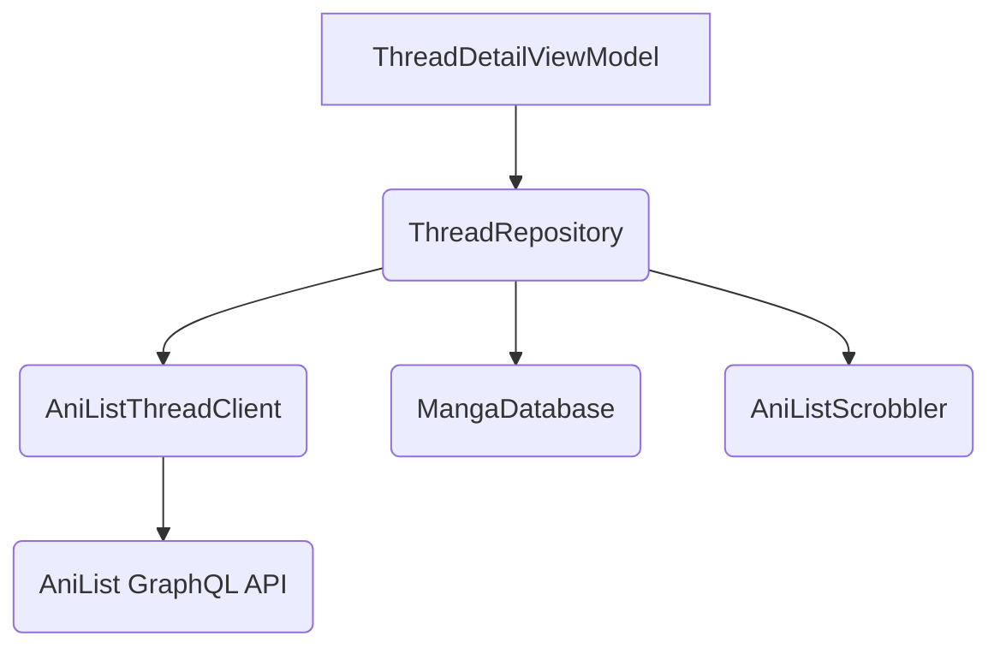
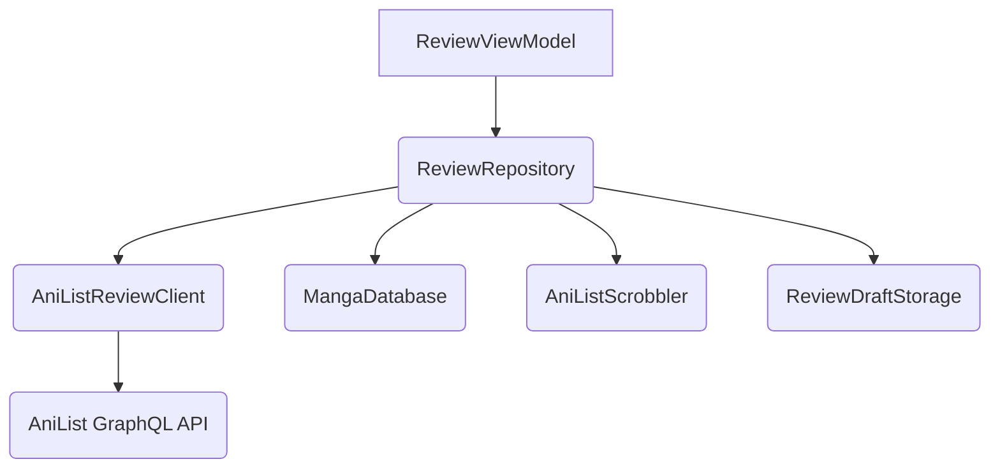

# AniList Features: Threads and Reviews

This document outlines the architecture of the AniList threads and reviews features within the Kotatsu application. Both features are designed with a modular approach, separating concerns into distinct layers to improve maintainability, testability, and scalability.

## Core Principles

The design of both the "threads" and "reviews" features is guided by the following principles:

*   **Separation of Concerns:** Each layer of the architecture has a distinct responsibility, from UI presentation to data fetching.
*   **Dependency Injection:** Hilt is used for dependency injection, which simplifies the management of dependencies and improves testability.
*   **Asynchronous Operations:** Coroutines and Flows are used to handle asynchronous operations, ensuring a responsive user interface.
*   **Data Caching:** Repositories implement caching strategies to minimize network requests and improve performance.
*   **Error Handling:** A consistent error handling mechanism is used to manage and report errors to the user.

---

## Threads Feature

The "threads" feature allows users to view and participate in discussions related to a specific manga.

### Architecture Overview

The architecture of the "threads" feature is divided into three main layers:

1.  **UI Layer:** `ThreadDetailViewModel.kt`
2.  **Repository Layer:** `ThreadRepository.kt`
3.  **Data Layer:** `AniListThreadClient.kt`

### UI Layer: `ThreadDetailViewModel.kt`

*   **Responsibilities:**
    *   Manages the UI state for the thread detail screen (`ThreadDetailUiState`).
    *   Handles user interactions, such as posting a new comment or loading more comments.
    *   Communicates with the `ThreadRepository` to fetch and update thread data.
*   **Key Components:**
    *   `_state`: A `MutableStateFlow` that holds the current UI state.
    *   `loadInitial()`: Fetches the initial thread data and comments.
    *   `loadMore()`: Fetches additional pages of comments.
    *   `postComment()`: Posts a new comment to the thread.

### Repository Layer: `ThreadRepository.kt`

*   **Responsibilities:**
    *   Acts as a single source of truth for thread and comment data.
    *   Fetches data from the `AniListThreadClient`.
    *   Caches thread data, comments, and pagination information to avoid redundant network calls.
    *   Handles authorization by checking if the user is logged into AniList.
    *   Provides a fallback mechanism to resolve AniList media IDs.
*   **Key Components:**
    *   `fetchThread()`: Fetches a thread and its first page of comments.
    *   `fetchComments()`: Fetches a specific page of comments for a thread.
    *   `saveComment()`: Saves a new comment.
    *   `deleteComment()`: Deletes a comment.

### Data Layer: `AniListThreadClient.kt`

*   **Responsibilities:**
    *   Handles all communication with the AniList GraphQL API for threads and comments.
    *   Constructs and executes GraphQL queries and mutations.
    *   Parses JSON responses from the API into application-specific data models.
    *   Implements retry logic with exponential backoff to handle rate limiting.
*   **Key Components:**
    *   `getThread()`: Fetches a thread and its comments.
    *   `getComment()`: Fetches a single comment.
    *   `saveComment()`: Saves a comment (either as a new comment or an update).
    *   `deleteComment()`: Deletes a comment.

---

## Reviews Feature

The "reviews" feature allows users to read and write reviews for a specific manga.

### Architecture Overview

The architecture of the "reviews" feature mirrors that of the "threads" feature, with a similar three-layer design:

1.  **UI Layer:** (Presumed `ReviewViewModel.kt`)
2.  **Repository Layer:** `ReviewRepository.kt`
3.  **Data Layer:** `AniListReviewClient.kt`

### UI Layer: `ReviewViewModel.kt` (Presumed)

*   **Responsibilities:**
    *   Manages the UI state for the review screen.
    *   Handles user interactions, such as writing, posting, or rating a review.
    *   Communicates with the `ReviewRepository` to fetch and update review data.

### Repository Layer: `ReviewRepository.kt`

*   **Responsibilities:**
    *   Acts as a single source of truth for review data.
    *   Fetches data from the `AniListReviewClient`.
    *   Caches the list of reviews and pagination information.
    *   Manages user-specific data, such as their own review and drafts.
    *   Handles saving, loading, and clearing review drafts via `ReviewDraftStorage`.
    *   Provides methods for posting, deleting, and rating reviews.
*   **Key Components:**
    *   `getReviews()`: Fetches a paginated list of reviews.
    *   `saveReview()`: Saves a user'''s review.
    *   `deleteReview()`: Deletes a user'''s review.
    *   `rateReview()`: Rates another user'''s review.
    *   `saveDraft()`: Saves a review draft.
    *   `getDraft()`: Retrieves a saved draft.

### Data Layer: `AniListReviewClient.kt`

*   **Responsibilities:**
    *   Handles all communication with the AniList GraphQL API for reviews.
    *   Constructs and executes GraphQL queries and mutations related to reviews.
    *   Parses JSON responses from the API into review-specific data models.
    *   Implements retry logic to handle API rate limiting.
*   **Key Components:**
    *   `getReviews()`: Fetches a list of reviews for a given manga.
    *   `saveReview()`: Saves a review.
    *   `deleteReview()`: Deletes a review.
    *   `rateReview()`: Submits a rating for a review.
