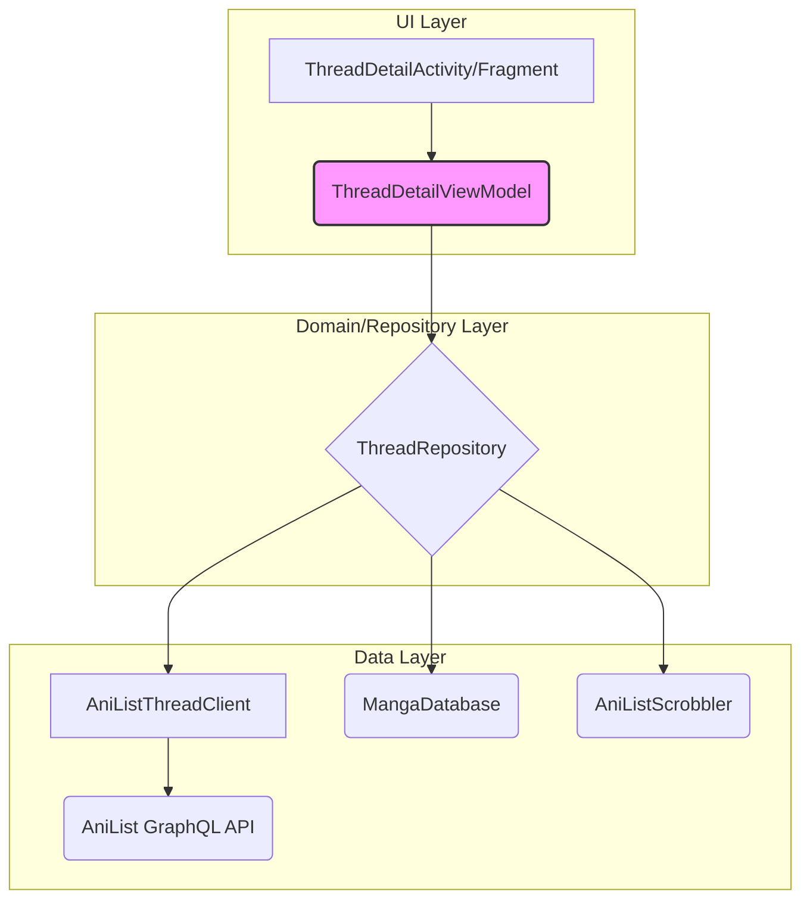

# Deep Dive: The AniList Threads Feature

This document provides a comprehensive analysis of the "threads" feature in the Kotatsu application. It details the architecture, data flow, and responsibilities of each component, serving as a technical reference for future development and maintenance.

## 1. Feature Overview

The "threads" feature allows users to view and participate in discussions related to a specific manga on AniList. Users can view a thread, read comments, load more comments (with pagination), and post their own comments.

## 2. Architecture

The feature follows a clean, layered architecture that separates concerns, making the system robust, testable, and maintainable.



*   **UI Layer:** Responsible for displaying the UI and forwarding user actions to the ViewModel.
*   **ViewModel (`ThreadDetailViewModel`):** Acts as the state holder for the UI. It fetches data from the repository, formats it for display, and handles user interactions.
*   **Repository (`ThreadRepository`):** The single source of truth for thread data. It abstracts the data source from the ViewModel, handling data fetching, caching, and business logic.
*   **Data Layer (`AniListThreadClient`):** The component responsible for making network requests to the AniList GraphQL API.

---

## 3. Core Components Breakdown

### 3.1. `ThreadDetailViewModel.kt`

This is the brain of the UI. It connects the user's actions to the underlying data repository and manages the UI state.

**Key Responsibilities:**

*   **State Management:** Holds the UI state in a `StateFlow<ThreadDetailUiState>`. The UI observes this flow and updates itself whenever the state changes. The state can be `Loading`, `Error`, or `Content`.
*   **Data Fetching:** It is initialized with a `threadId` from the `SavedStateHandle`. It uses this ID to orchestrate the initial data load (`loadInitial`) and subsequent paginated loads (`loadMore`).
*   **User Action Handling:** Exposes functions like `reload()`, `loadMore()`, and `postComment(body: String)` that the UI can call in response to user input.
*   **Inheritance from `BaseViewModel`:** It leverages the powerful `BaseViewModel` to handle boilerplate for loading states and error propagation automatically via `launchLoadingJob` and `errorEvent`.

**State Management (`ThreadDetailUiState`):**

The `sealed class ThreadDetailUiState` is a perfect example of modeling UI state effectively:

*   `Loading`: The initial state while the thread is being fetched.
*   `Error`: Represents a state where the initial load failed.
*   `Content`: The success state, which contains all the data needed to render the screen:
    *   `thread`: The main `AniListThread` object.
    *   `comments`: A flattened `List<ThreadCommentItem>` ready for the `RecyclerView`.
    *   `viewer`: The `AniListViewer` object, used to determine if the current user can post.
    *   `hasMore` & `isLoadingMore`: Booleans to control the pagination UI.

**Data Transformation (`flatten`):**

The private `flatten` extension function is a crucial piece of logic. It transforms the hierarchical list of `AniListThreadComment` (which can have nested children) into a flat `List<ThreadCommentItem>`. It also calculates the `depth` of each comment, which is then used by the UI to render indentation, visually representing the comment hierarchy.

```kotlin
private fun List<AniListThreadComment>.flatten(depth: Int = 0): List<ThreadCommentItem> {
	val result = ArrayList<ThreadCommentItem>()
	for (comment in this) {
		result.add(ThreadCommentItem(comment, depth))
		if (comment.children.isNotEmpty()) {
			result.addAll(comment.children.flatten(depth + 1))
		}
	}
	return result
}
```

### 3.2. `ThreadRepository.kt`

The repository is the intermediary between the ViewModel and the raw data sources. It encapsulates all data-related logic.

*   **Data Aggregation:** It's responsible for calling the `AniListThreadClient` to get raw thread and comment data.
*   **Business Logic:** It contains logic like checking if a user is logged in (`AniListScrobbler`) or if a manga is tracked (`MangaDatabase`) before performing actions.
*   **Caching:** (As understood from previous analysis) It likely caches fetched thread data to avoid unnecessary network requests on configuration changes or subsequent views.
*   **Abstraction:** It provides a clean API to the ViewModel (`fetchThread`, `fetchComments`, `saveComment`). The ViewModel doesn't need to know about GraphQL, REST, or where the data is coming from.

### 3.3. `AniListThreadClient.kt`

This client is a low-level component that deals exclusively with the network communication to the AniList API.

*   **GraphQL Execution:** It constructs the specific GraphQL query strings for fetching threads and comments and mutations for saving or deleting them.
*   **Network Handling:** It uses `OkHttpClient` to execute the requests.
*   **Error & Rate Limit Handling:** (As understood from previous analysis) It contains crucial logic to handle API-specific errors and respects `Retry-After` headers for rate limiting, making the application a good API citizen.
*   **Data Parsing:** It parses the JSON responses from the API into the Kotlin data classes (`AniListThread`, `AniListThreadComment`, etc.).

---

## 4. Data Flow Example: Initial Load

To understand how the pieces work together, let's trace the initial data loading sequence:

1.  **`ThreadDetailViewModel` is created.**
2.  `init` block calls `reload()`.
3.  `reload()` sets the UI state to `ThreadDetailUiState.Loading`.
4.  `reload()` calls `launchLoadingJob { loadInitial() }`.
    *   `BaseViewModel` automatically increments its `loadingCounter`, which could show a global progress indicator.
5.  `loadInitial()` in the ViewModel calls `repository.fetchThread(threadId)`.
6.  `ThreadRepository` checks its cache. If the data is not present or stale, it calls `aniListThreadClient.getThread(threadId)`.
7.  `AniListThreadClient` executes the GraphQL query against the AniList API.
8.  The data flows back up: API -> Client -> Repository -> ViewModel.
9.  `loadInitial()` also calls `repository.getViewer()` to get user info.
10. On success, `loadInitial()` transforms the data (including calling `.flatten()` on the comments) and updates the ViewModel's `_state` with `ThreadDetailUiState.Content(...)`.
11. On failure, the `runCatching` block catches the exception, and `errorEvent.call(error)` is invoked. `BaseActivity` observes this and shows an error message. The state is set to `ThreadDetailUiState.Error`.
12. The `launchLoadingJob` block finishes, and `BaseViewModel` automatically decrements the `loadingCounter`.

This entire process is asynchronous, non-blocking, and handled with structured concurrency thanks to Kotlin Coroutines.

---
## Appendix A: Source Code

### `/app/src/main/kotlin/org/koitharu/kotatsu/threads/ThreadDetailViewModel.kt`

```kotlin
package org.koitharu.kotatsu.threads

import androidx.lifecycle.SavedStateHandle
import dagger.hilt.android.lifecycle.HiltViewModel
import kotlinx.coroutines.flow.MutableStateFlow
import kotlinx.coroutines.flow.StateFlow
import org.koitharu.kotatsu.R
import org.koitharu.kotatsu.core.ui.BaseViewModel
import org.koitharu.kotatsu.core.util.ext.EventFlow
import org.koitharu.kotatsu.core.util.ext.MutableEventFlow
import org.koitharu.kotatsu.core.util.ext.call
import org.koitharu.kotatsu.reviews.AniListViewer
import javax.inject.Inject

const val THREAD_EXTRA_THREAD_ID = "threadId"

@HiltViewModel
class ThreadDetailViewModel @Inject constructor(
	private val savedStateHandle: SavedStateHandle,
	private val repository: ThreadRepository,
) : BaseViewModel() {

	private val threadId: Long = requireNotNull(savedStateHandle.get<Long>(THREAD_EXTRA_THREAD_ID)) {
		"Thread id required"
	}

	val mangaTitle: String? = savedStateHandle.get<String>(THREAD_ARG_MANGA_TITLE)

	private val _state = MutableStateFlow<ThreadDetailUiState>(ThreadDetailUiState.Loading)
	val state: StateFlow<ThreadDetailUiState> = _state

	private val _messages = MutableEventFlow<ThreadMessage>()
	val messages: EventFlow<ThreadMessage> = _messages

	private var currentPage: Int = 1
	private var hasNextPage: Boolean = false

	init {
		reload()
	}

	fun reload() {
		currentPage = 1
		hasNextPage = false
		_state.value = ThreadDetailUiState.Loading
		launchLoadingJob {
			loadInitial()
		}
	}

	fun loadMore() {
		val content = _state.value as? ThreadDetailUiState.Content ?: return
		if (!hasNextPage || content.isLoadingMore) {
			return
		}
		_state.value = content.copy(isLoadingMore = true)
		launchJob {
			runCatching {
				repository.fetchComments(threadId, page = currentPage + 1)
			}.onSuccess { page ->
				currentPage = page.currentPage
				hasNextPage = page.hasNextPage
				val appended = content.comments + page.comments.flatten(depth = 0)
				_state.value = content.copy(
					comments = appended,
					hasMore = hasNextPage,
					isLoadingMore = false,
				)
			}.onFailure { error ->
				_state.value = content.copy(isLoadingMore = false)
				errorEvent.call(error)
			}
		}
	}

	fun postComment(body: String) {
		val content = _state.value as? ThreadDetailUiState.Content ?: return
		if (content.viewer == null) {
			return
		}
		if (body.isBlank()) {
			return
		}
		launchLoadingJob {
			runCatching {
				repository.saveComment(threadId, parentCommentId = null, comment = body)
			}.onSuccess { comment ->
				val newList = listOf(ThreadCommentItem(comment, depth = 0)) + content.comments
				_state.value = content.copy(comments = newList)
				_messages.call(ThreadMessage.Resource(R.string.thread_comment_posted))
			}.onFailure { error ->
				errorEvent.call(error)
			}
		}
	}

	private suspend fun loadInitial() {
		runCatching {
			val result = repository.fetchThread(threadId) ?: throw IllegalStateException("Thread not found")
			val viewer = repository.getViewer()
			Triple(result.thread, result.commentPage, viewer)
		}.onSuccess { (thread, page, viewer) ->
			currentPage = page.currentPage
			hasNextPage = page.hasNextPage
			val comments = page.comments.flatten()
			_state.value = ThreadDetailUiState.Content(
				thread = thread,
				comments = comments,
				viewer = viewer,
				hasMore = hasNextPage,
				isLoadingMore = false,
			)
		}.onFailure { error ->
			errorEvent.call(error)
			_state.value = ThreadDetailUiState.Error
		}
	}
}

sealed class ThreadDetailUiState {
	object Loading : ThreadDetailUiState()
	object Error : ThreadDetailUiState()
	data class Content(
		val thread: AniListThread,
		val comments: List<ThreadCommentItem>,
		val viewer: AniListViewer?,
		val hasMore: Boolean,
		val isLoadingMore: Boolean,
	) : ThreadDetailUiState()
}

data class ThreadCommentItem(
	val comment: AniListThreadComment,
	val depth: Int,
)

private fun List<AniListThreadComment>.flatten(depth: Int = 0): List<ThreadCommentItem> {
	val result = ArrayList<ThreadCommentItem>()
	for (comment in this) {
		result.add(ThreadCommentItem(comment, depth))
		if (comment.children.isNotEmpty()) {
			result.addAll(comment.children.flatten(depth + 1))
		}
	}
	return result
}
```

## Appendix B: Build Configuration

### `build.gradle` (Root)
```groovy
plugins {
	alias(libs.plugins.android.application) apply false
	alias(libs.plugins.kotlin) apply false
	alias(libs.plugins.hilt) apply false
	alias(libs.plugins.ksp) apply false
	alias(libs.plugins.room) apply false
	alias(libs.plugins.kotlinx.serizliation) apply false
//	alias(libs.plugins.decoroutinator) apply false
}
```

### `settings.gradle`
```groovy
pluginManagement {
	repositories {
		google()
		mavenCentral()
		gradlePluginPortal()
		maven {
			url 'https://jitpack.io'
		}
	}
}
dependencyResolutionManagement {
	repositoriesMode.set(RepositoriesMode.FAIL_ON_PROJECT_REPOS)
	repositories {
		google()
		mavenCentral()
		maven {
			url 'https://jitpack.io'
		}
	}
}

include ':app'
rootProject.name = "Kotatsu"
```

### `gradle/libs.versions.toml`
```toml
[versions]
acra = "5.12.0"
activity = "1.10.1"
adapterdelegates = "4.3.2"
appcompat = "1.7.1"
avifDecoder = "1.1.1.14d8e3c4"
biometric = "1.4.0-alpha04"
coil = "3.2.0"
collections = "1.5.0"
#noinspection NewerVersionAvailable,GradleDependency - 2.5.3 cause crashes
conscrypt = "2.5.2"
constraintlayout = "2.2.1"
coreKtx = "1.16.0"
coroutines = "1.10.2"
dagger = "2.56.2"
decoroutinator = "2.5.5"
desugar = "2.1.5"
diskLruCache = "1.5"
documentfile = "1.1.0"
fragment = "1.8.8"
gradle = "8.11.1"
guava = "33.4.8-android"
hilt = "1.2.0"
json = "20250517"
junit = "4.13.2"
junitKtx = "1.2.1"
kotlin = "2.1.21"
kizzyRpc = "ad8f2e32eb"
ksp = "2.1.21-2.0.1"
leakcanary = "3.0-alpha-8"
lifecycle = "2.9.1"
markwon = "4.6.2"
material = "1.14.0-alpha05"
moshi = "1.15.2"
okhttp = "4.12.0"
okio = "3.12.0"
parsers = "8a147dbdd3"
preference = "1.2.1"
recyclerview = "1.4.0"
room = "2.7.2"
serialization = "1.8.1"
ssiv = "376930523c"
swiperefreshlayout = "1.1.0"
testRules = "1.6.1"
testRunner = "1.6.2"
transition = "1.6.0"
viewpager2 = "1.1.0"
webkit = "1.13.0"
workRuntime = "2.10.2"
workinspector = "1.2"

[libraries]
acra-dialog = { module = "ch.acra:acra-dialog", version.ref = "acra" }
acra-http = { module = "ch.acra:acra-http", version.ref = "acra" }
adapterdelegates = { module = "com.hannesdorfmann:adapterdelegates4-kotlin-dsl", version.ref = "adapterdelegates" }
adapterdelegates-viewbinding = { module = "com.hannesdorfmann:adapterdelegates4-kotlin-dsl-viewbinding", version.ref = "adapterdelegates" }
androidx-activity = { module = "androidx.activity:activity-ktx", version.ref = "activity" }
androidx-appcompat = { module = "androidx.appcompat:appcompat", version.ref = "appcompat" }
androidx-biometric = { module = "androidx.biometric:biometric", version.ref = "biometric" }
androidx-collection = { module = "androidx.collection:collection-ktx", version.ref = "collections" }
androidx-constraintlayout = { module = "androidx.constraintlayout:constraintlayout", version.ref = "constraintlayout" }
androidx-core = { module = "androidx.core:core-ktx", version.ref = "coreKtx" }
androidx-documentfile = { module = "androidx.documentfile:documentfile", version.ref = "documentfile" }
androidx-fragment = { module = "androidx.fragment:fragment-ktx", version.ref = "fragment" }
androidx-hilt-compiler = { module = "androidx.hilt:hilt-compiler", version.ref = "hilt" }
androidx-hilt-work = { module = "androidx.hilt:hilt-work", version.ref = "hilt" }
androidx-junit = { module = "androidx.test.ext:junit-ktx", version.ref = "junitKtx" }
androidx-lifecycle-common-java8 = { module = "androidx.lifecycle:lifecycle-common-java8", version.ref = "lifecycle" }
androidx-preference = { module = "androidx.preference:preference-ktx", version.ref = "preference" }
androidx-recyclerview = { module = "androidx.recyclerview:recyclerview", version.ref = "recyclerview" }
androidx-room-compiler = { module = "androidx.room:room-compiler", version.ref = "room" }
androidx-room-ktx = { module = "androidx.room:room-ktx", version.ref = "room" }
androidx-room-runtime = { module = "androidx.room:room-runtime", version.ref = "room" }
androidx-room-testing = { module = "androidx.room:room-testing", version.ref = "room" }
androidx-rules = { module = "androidx.test:rules", version.ref = "testRules" }
androidx-runner = { module = "androidx.test:runner", version.ref = "testRunner" }
androidx-swiperefreshlayout = { module = "androidx.swiperefreshlayout:swiperefreshlayout", version.ref = "swiperefreshlayout" }
androidx-test-core = { module = "androidx.test:core-ktx", version.ref = "testRules" }
androidx-transition = { module = "androidx.transition:transition-ktx", version.ref = "transition" }
androidx-viewpager2 = { module = "androidx.viewpager2:viewpager2", version.ref = "viewpager2" }
androidx-webkit = { module = "androidx.webkit:webkit", version.ref = "webkit" }
androidx-work-runtime = { module = "androidx.work:work-runtime", version.ref = "workRuntime" }
avif-decoder = { module = "org.aomedia.avif.android:avif", version.ref = "avifDecoder" }
coil-core = { module = "io.coil-kt.coil3:coil-core", version.ref = "coil" }
coil-gif = { module = "io.coil-kt.coil3:coil-gif", version.ref = "coil" }
coil-network = { module = "io.coil-kt.coil3:coil-network-okhttp", version.ref = "coil" }
coil-svg = { module = "io.coil-kt.coil3:coil-svg", version.ref = "coil" }
conscrypt-android = { module = "org.conscrypt:conscrypt-android", version.ref = "conscrypt" }
desugar_jdk_libs = { module = "com.android.tools:desugar_jdk_libs", version.ref = "desugar" }
disk-lru-cache = { module = "com.github.solkin:disk-lru-cache", version.ref = "diskLruCache" }
guava = { module = "com.google.guava:guava", version.ref = "guava" }
hilt-android = { module = "com.google.dagger:hilt-android", version.ref = "dagger" }
hilt-android-compiler = { module = "com.google.dagger:hilt-android-compiler", version.ref = "dagger" }
hilt-android-testing = { module = "com.google.dagger:hilt-android-testing", version.ref = "dagger" }
hilt-compiler = { module = "com.google.dagger:hilt-compiler", version.ref = "dagger" }
json = { module = "org.json:json", version.ref = "json" }
junit = { module = "junit:junit", version.ref = "junit" }
kizzyrpc = { module = "com.github.dead8309:KizzyRPC", version.ref = "kizzyRpc" }
kotlin-stdlib = { module = "org.jetbrains.kotlin:kotlin-stdlib", version.ref = "kotlin" }
kotlinx-coroutines-android = { module = "org.jetbrains.kotlinx:kotlinx-coroutines-android", version.ref = "coroutines" }
kotlinx-coroutines-guava = { module = "org.jetbrains.kotlinx:kotlinx-coroutines-guava", version.ref = "coroutines" }
kotlinx-coroutines-test = { module = "org.jetbrains.kotlinx:kotlinx-coroutines-test", version.ref = "coroutines" }
kotlinx-serialization-json = { module = "org.jetbrains.kotlinx:kotlinx-serialization-json-jvm", version.ref = "serialization" }
leakcanary-android = { module = "com.squareup.leakcanary:leakcanary-android", version.ref = "leakcanary" }
lifecycle-process = { module = "androidx.lifecycle:lifecycle-process", version.ref = "lifecycle" }
lifecycle-service = { module = "androidx.lifecycle:lifecycle-service", version.ref = "lifecycle" }
lifecycle-viewmodel = { module = "androidx.lifecycle:lifecycle-viewmodel-ktx", version.ref = "lifecycle" }
markwon = { module = "io.noties.markwon:core", version.ref = "markwon" }
material = { module = "com.google.android.material:material", version.ref = "material" }
moshi-kotlin = { module = "com.squareup.moshi:moshi-kotlin", version.ref = "moshi" }
okhttp = { module = "com.squareup.okhttp3:okhttp", version.ref = "okhttp" }
okhttp-dnsoverhttps = { module = "com.squareup.okhttp3:okhttp-dnsoverhttps", version.ref = "okhttp" }
okhttp-tls = { module = "com.squareup.okhttp3:okhttp-tls", version.ref = "okhttp" }
okio = { module = "com.squareup.okio:okio", version.ref = "okio" }
ssiv = { module = "com.github.KotatsuApp:subsampling-scale-image-view", version.ref = "ssiv" }
workinspector = { module = "com.github.Koitharu:WorkInspector", version.ref = "workinspector" }

[plugins]
android-application = { id = "com.android.application", version.ref = "gradle" }
hilt = { id = "com.google.dagger.hilt.android", version.ref = "dagger" }
kotlin = { id = "org.jetbrains.kotlin.android", version.ref = "kotlin" }
kotlinx-serizliation = { id = "org.jetbrains.kotlin.plugin.serialization", version.ref = "kotlin" }
ksp = { id = "com.google.devtools.ksp", version.ref = "ksp" }
room = { id = "androidx.room", version.ref = "room" }
decoroutinator = { id = "dev.reformator.stacktracedecoroutinator", version.ref = "decoroutinator" }
```

### `/app/build.gradle`
```groovy
import java.time.LocalDateTime

plugins {
	id 'com.android.application'
	id 'kotlin-android'
	id 'com.google.devtools.ksp'
	id 'kotlin-parcelize'
	id 'dagger.hilt.android.plugin'
	id 'androidx.room'
	id 'org.jetbrains.kotlin.plugin.serialization'
	// enable if needed
	// id 'dev.reformator.stacktracedecoroutinator'
}

android {
	compileSdk = 36
	buildToolsVersion = '35.0.0'
	namespace = 'org.koitharu.kotatsu'

	defaultConfig {
		applicationId 'org.koitharu.kotatsu'
		minSdk = 21
		targetSdk = 36
		versionCode = 1028
		versionName = '9.1.4'
		generatedDensities = []
		testInstrumentationRunner 'org.koitharu.kotatsu.HiltTestRunner'
		ksp {
			arg('room.generateKotlin', 'true')
		}
		androidResources {
			// https://issuetracker.google.com/issues/408030127
			generateLocaleConfig false
		}
		def localProperties = new Properties()
		def localPropertiesFile = rootProject.file('local.properties')
		if (localPropertiesFile.exists()) {
			localProperties.load(new FileInputStream(localPropertiesFile))
		}
		resValue 'string', 'tg_backup_bot_token', localProperties.getProperty('tg_backup_bot_token', '')
	}
	buildTypes {
		debug {
			applicationIdSuffix = '.debug'
		}
		release {
			minifyEnabled true
			shrinkResources true
			proguardFiles getDefaultProguardFile('proguard-android-optimize.txt'), 'proguard-rules.pro'
		}
		nightly {
			initWith release
			applicationIdSuffix = '.nightly'
		}
	}
	buildFeatures {
		viewBinding true
		buildConfig true
	}
	packagingOptions {
		resources {
			excludes += [
				'META-INF/README.md',
				'META-INF/NOTICE.md'
			]
		}
	}
	sourceSets {
		androidTest.assets.srcDirs += files("$projectDir/schemas".toString())
		main.java.srcDirs += 'src/main/kotlin/'
	}
	compileOptions {
		coreLibraryDesugaringEnabled true
		sourceCompatibility JavaVersion.VERSION_11
		targetCompatibility JavaVersion.VERSION_11
	}
	kotlinOptions {
		jvmTarget = JavaVersion.VERSION_11.toString()
		freeCompilerArgs += [
			'-opt-in=kotlin.ExperimentalStdlibApi',
			'-opt-in=kotlinx.coroutines.ExperimentalCoroutinesApi',
			'-opt-in=kotlinx.coroutines.ExperimentalForInheritanceCoroutinesApi',
			'-opt-in=kotlinx.coroutines.InternalForInheritanceCoroutinesApi',
			'-opt-in=kotlinx.coroutines.FlowPreview',
			'-opt-in=kotlin.contracts.ExperimentalContracts',
			'-opt-in=coil3.annotation.ExperimentalCoilApi',
			'-opt-in=coil3.annotation.InternalCoilApi',
			'-opt-in=kotlinx.serialization.ExperimentalSerializationApi',
			'-Xjspecify-annotations=strict',
			'-Xtype-enhancement-improvements-strict-mode'
		]
	}
	room {
		schemaDirectory "$projectDir/schemas"
	}
	lint {
		abortOnError true
		disable 'MissingTranslation', 'PrivateResource', 'SetJavaScriptEnabled', 'SimpleDateFormat'
	}
	testOptions {
		unitTests.includeAndroidResources true
		unitTests.returnDefaultValues false
		kotlinOptions {
			freeCompilerArgs += ['-opt-in=org.koitharu.kotatsu.parsers.InternalParsersApi']
		}
	}
	applicationVariants.configureEach { variant ->
		if (variant.name == 'nightly') {
			variant.outputs.each { output ->
				def now = LocalDateTime.now()
				output.versionCodeOverride = now.format("yyMMdd").toInteger()
				output.versionNameOverride = 'N' + now.format("yyyyMMdd")
			}
		}
	}
}
dependencies {
	def parsersVersion = libs.versions.parsers.get()
	if (System.properties.containsKey('parsersVersionOverride')) {
		// usage:
		// -DparsersVersionOverride=$(curl -s https://api.github.com/repos/kotatsuapp/kotatsu-parsers/commits/master -H "Accept: application/vnd.github.sha" | cut -c -10)
		parsersVersion = System.getProperty('parsersVersionOverride')
	}
	//noinspection UseTomlInstead
	implementation("com.github.KotatsuApp:kotatsu-parsers:$parsersVersion") {
		exclude group: 'org.json', module: 'json'
	}

	coreLibraryDesugaring libs.desugar.jdk.libs
	implementation libs.kotlin.stdlib
	implementation libs.kotlinx.coroutines.android
	implementation libs.kotlinx.coroutines.guava

	implementation libs.androidx.appcompat
	implementation libs.androidx.core
	implementation libs.androidx.activity
	implementation libs.androidx.fragment
	implementation libs.androidx.transition
	implementation libs.androidx.collection
	implementation libs.lifecycle.viewmodel
	implementation libs.lifecycle.service
	implementation libs.lifecycle.process
	implementation libs.androidx.constraintlayout
	implementation libs.androidx.documentfile
	implementation libs.androidx.swiperefreshlayout
	implementation libs.androidx.recyclerview
	implementation libs.androidx.viewpager2
	implementation libs.androidx.preference
	implementation libs.androidx.biometric
	implementation libs.material
	implementation libs.androidx.lifecycle.common.java8
	implementation libs.androidx.webkit

	implementation libs.androidx.work.runtime
	implementation libs.guava

	implementation libs.androidx.room.runtime
	implementation libs.androidx.room.ktx
	ksp libs.androidx.room.compiler

	implementation libs.okhttp
	implementation libs.okhttp.tls
	implementation libs.okhttp.dnsoverhttps
	implementation libs.okio
	implementation libs.kotlinx.serialization.json

	implementation libs.adapterdelegates
	implementation libs.adapterdelegates.viewbinding

	implementation libs.hilt.android
	ksp libs.hilt.compiler
	implementation libs.androidx.hilt.work
	ksp libs.androidx.hilt.compiler

	implementation libs.coil.core
	implementation libs.coil.network
	implementation libs.coil.gif
	implementation libs.coil.svg
	implementation libs.avif.decoder
	implementation libs.ssiv
	implementation libs.disk.lru.cache
	implementation libs.markwon
	implementation libs.kizzyrpc

	implementation libs.acra.http
	implementation libs.acra.dialog

	implementation libs.conscrypt.android

	debugImplementation libs.leakcanary.android
	nightlyImplementation libs.leakcanary.android
	debugImplementation libs.workinspector

	testImplementation libs.junit
	testImplementation libs.json
	testImplementation libs.kotlinx.coroutines.test

	androidTestImplementation libs.androidx.runner
	androidTestImplementation libs.androidx.rules
	androidTestImplementation libs.androidx.test.core
	androidTestImplementation libs.androidx.junit

	androidTestImplementation libs.kotlinx.coroutines.test

	androidTestImplementation libs.androidx.room.testing
	androidTestImplementation libs.moshi.kotlin

	androidTestImplementation libs.hilt.android.testing
	kspAndroidTest libs.hilt.android.compiler
}
```
